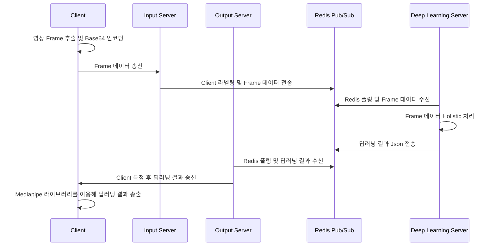
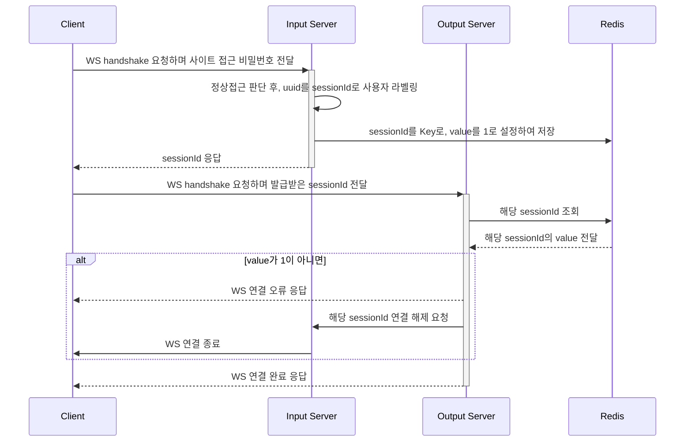

# 프로젝트 설계 문서

데이터베이스, 프로젝트 구조 등 설계 관련 문서입니다.

 

## Server Architecture

 

EC2 내의 모든 서비스는 Container 위에 구동됩니다. 
모든 요청을 한곳에서 관리하기 위해 Nginx를 이용하였습니다. 
기능 별 분리된 구조를 택하여 각 서비스 간 부하를 줄이는데 노력하였습니다. 

 

## Streaming Process

 

분산 환경에서 서비스 간 통신을 위해 Redis Pub/Sub 어플리케이션을 이용하였습니다. 
실시간 영상 서비스인만큼, 데이터 유실에 부담을 갖지 않아도 된다 생각하여 Kafka보다 가벼운 Redis를 이용하였습니다. 
서버에서 딥러닝 처리에 대한 오버헤드가 커질것을 예상하여 각 서비스 별 비동기를 이용한 멀티스레드를 적절히 이용하였습니다. 

 

## Socket Connection

 

분산 환경에서 원하는 결과를 도출해내기 위해 Client를 특정할 수 있는 라벨링을 시도했습니다. 
uuid를 이용해 Client에게 고유번호를 부여하였고, 여러 사용자가 접속해도 처리가 가능한 환경을 구성하였습니다. 
비정상적인 접근을 방지하고자 Redis를 이용하여 Session 정보를 저장하였고, 이를 통해 Input/Output Server 간 인증에 관한 Sync를 맞출 수 있었습니다. 

 
